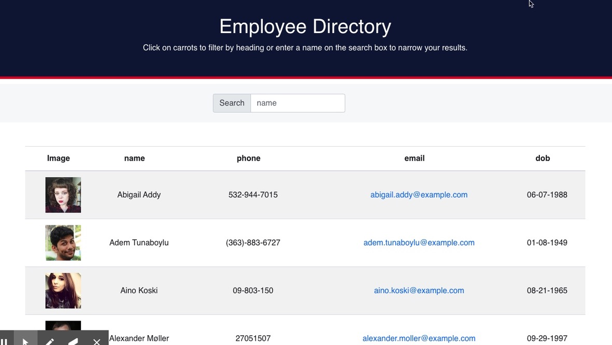

# Employee_Directoy
Employee directory application with React

_ Created with the help of **_npx create-react-app_**, this employee directory app allows user to access and mange employees from a given API. User can search for an employee using their first or last name. User can also perform a search or classify employee by date of birth (older to yougest or vice vers ca), name or phone number by directly clicking on them from the header. 

# Demo

# Technologies used

**React**

**Github**

**Npm**

**Css**

**Html**

**Javascrip**

**Bootstrap**

# API used: 
https://randomuser.me/api/?results=200&nat=u

# Links

Click on one of the links bellow to access the repository

[deployed website](https://snubia.github.io/User_Directory/)

[Github repository](https://github.com/Snubia/User_Directory.git)

# For feedback, contributions or questions

[Linkedin](https://www.linkedin.com/in/sandrine-nubia-975aa2172/)

[Github](https://github.com/Snubia)

